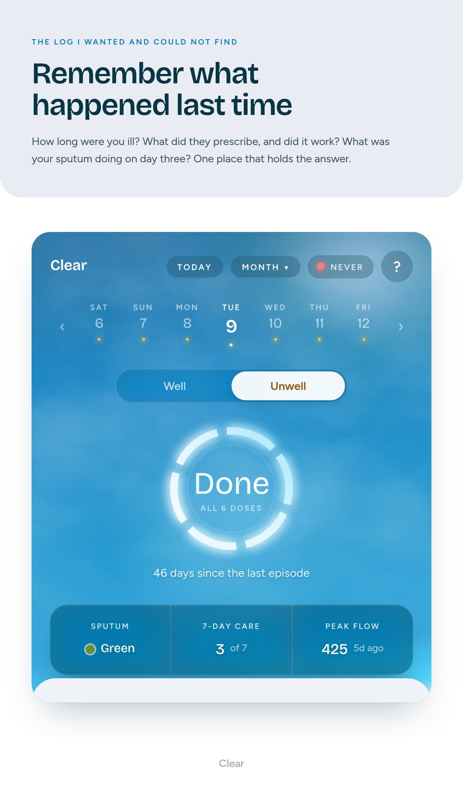
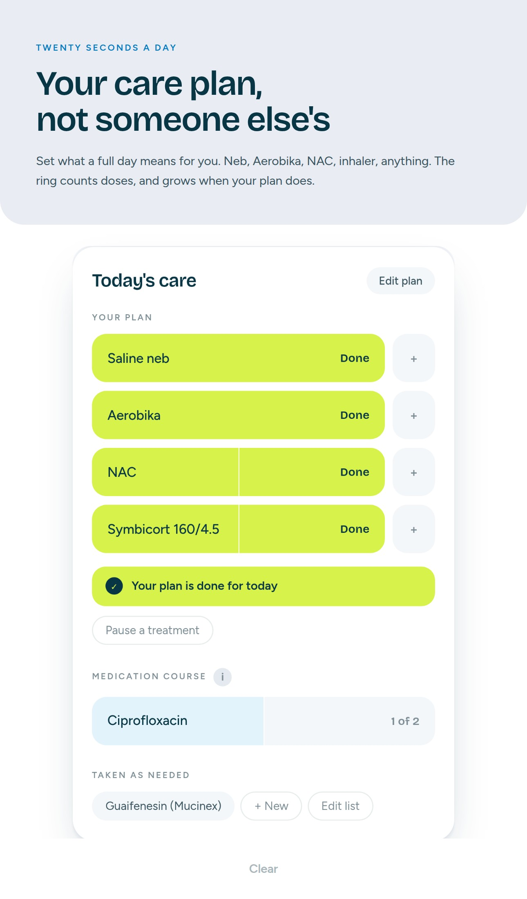
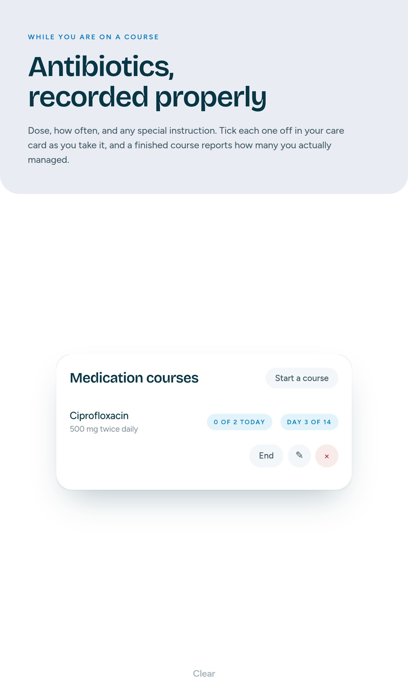
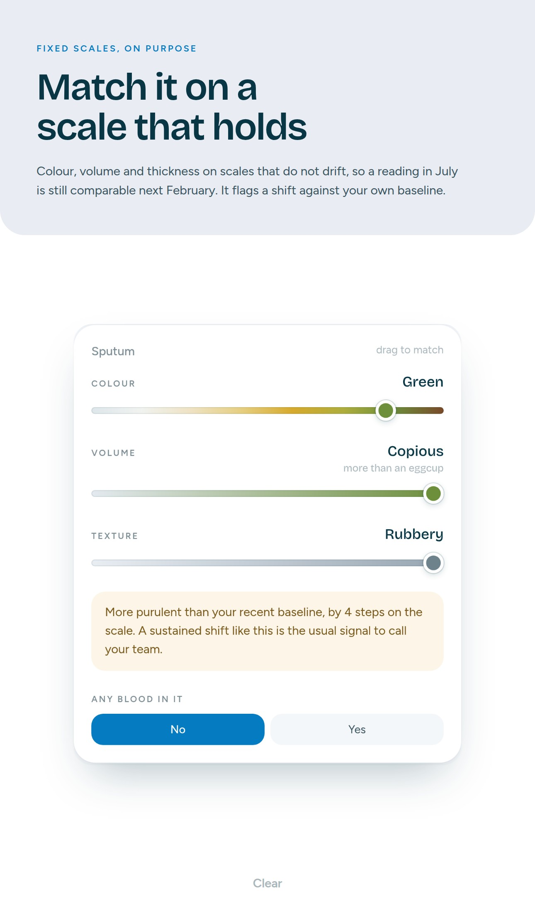
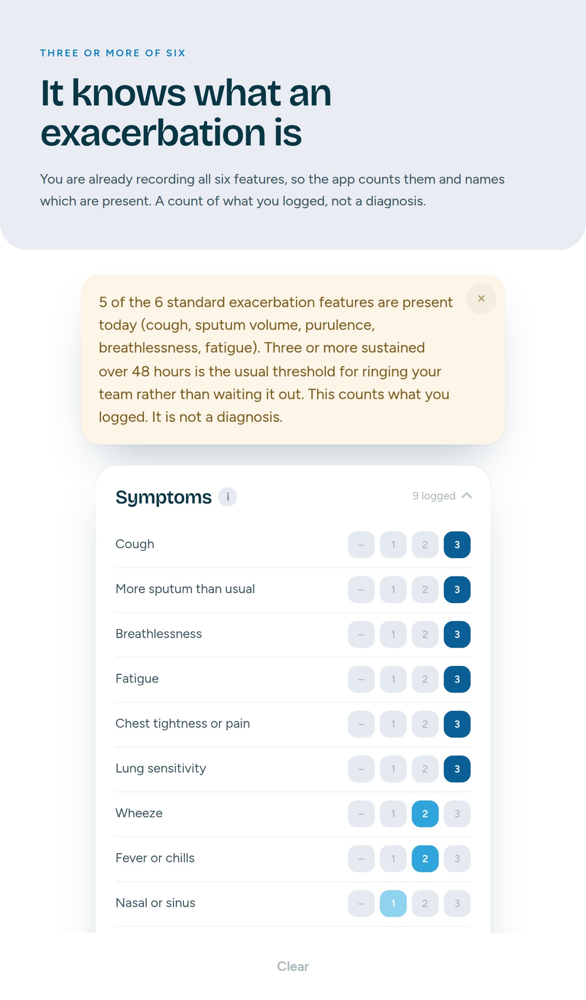
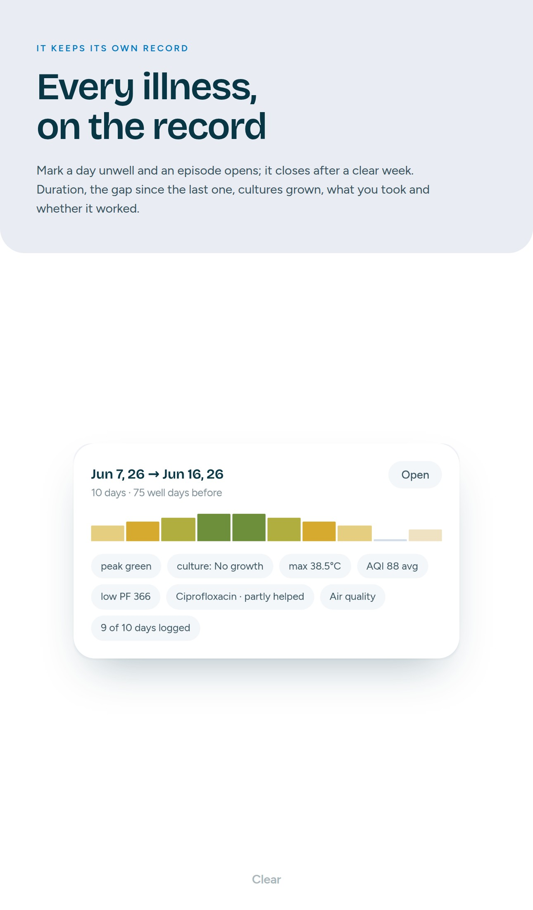
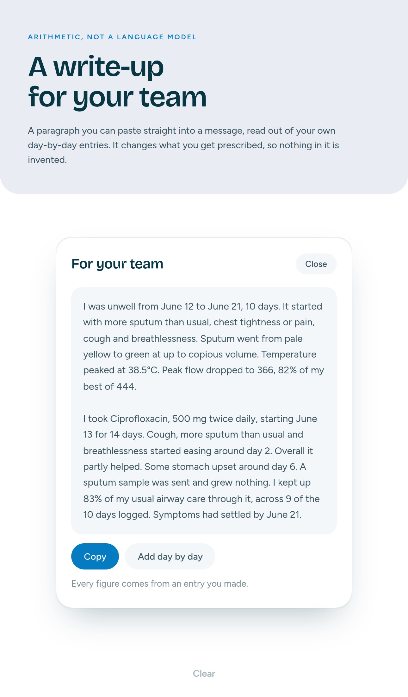
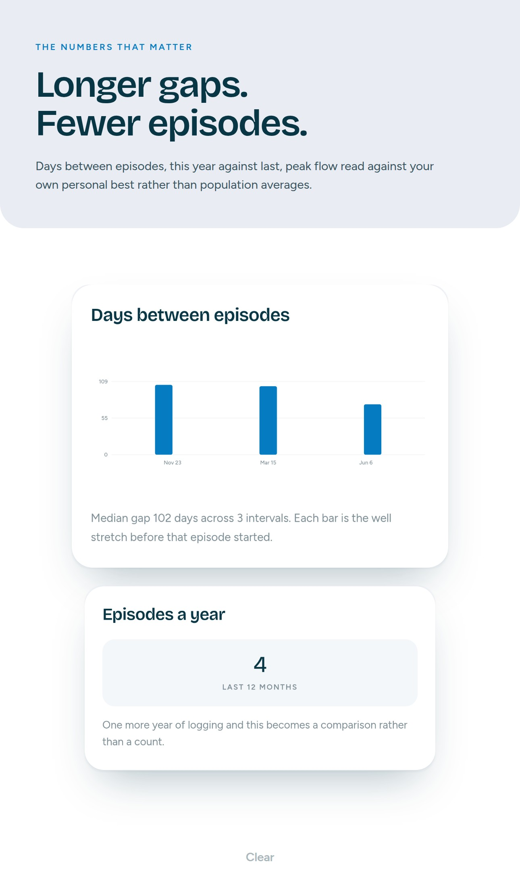
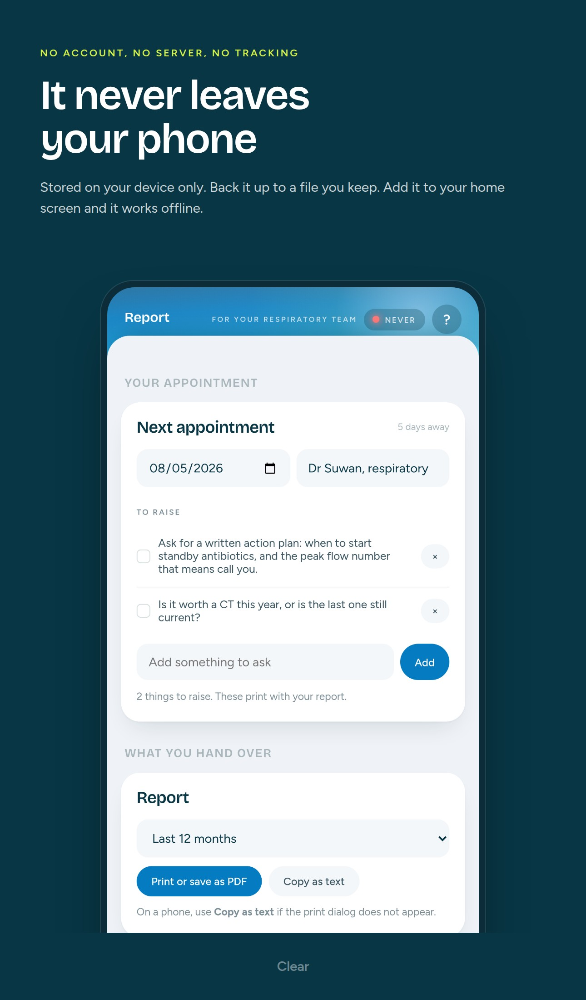

# Clear

**A private log for bronchiectasis, cystic fibrosis and COPD. Runs in your browser, keeps every entry on your device, and writes up your exacerbations for your respiratory team.**

Every time I got another chest infection I hit the same wall. How long was I ill last time? Did I see anyone? What did they prescribe, at what dose, and did it actually work? What was my sputum doing on day three? I could never remember, which turned every appointment into a guessing game.

So I built this. It is the log I wanted and could not find.

No account. No server. Nothing is sent anywhere. Add it to your home screen and it behaves like an app, offline.

## → [Open Clear](https://clearlungs.app)

Open that on your phone and add it to your home screen. Nothing to sign up for, nothing to install from a store. Instructions below.

---

## What it does

**Daily airway care, on your plan.** Add your own treatments with the doses a day each one needs. Nebulised saline, an oscillating PEP device, mucolytics, a maintenance inhaler, anything. A ring at the top fills as you tick doses off, and it grows or shrinks when your plan changes. It is not built around anyone else's regimen.

**Antibiotic courses, dose by dose.** Record a course with its dose and how often you take it, then tick each dose off the way you do your daily care. That count is kept separate from your airway care, so neither number quietly changes what the other one means. When a course finishes it tells you how many of the expected doses you actually logged, which matters when you are trying to work out whether something helped or whether you just missed half of it.

**Sputum on scales that hold up over years.** Colour on an eight-step chart from clear to rust, volume in seven steps with a physical measure under each, and thickness from watery to rubbery. Fixed scales, deliberately, so a reading in July is genuinely comparable to one next February. It also tells you when your colour has shifted against your own recent baseline, which is the earliest reliable warning you get.

**It counts exacerbation features for you, against your own condition's definition.** Bronchiectasis counts three or more of six: increased cough, sputum volume, purulence, breathlessness, fatigue, haemoptysis. COPD uses a different rule — two or more of breathlessness, sputum volume and purulence. You are already recording all of them, so the app counts each rule separately and names which features are present. Pick more than one condition and you see more than one count, because they often come together and blending them would make both wrong. It is a count of what you logged, not a diagnosis.

**Episodes form on their own.** Mark a day unwell and an episode opens; it closes after a clear week. From that you get duration, the gap since your last one, peak sputum colour, cultures grown, which antibiotics overlapped, and whether they worked. If you realise it started before you noticed, set the real onset date and it backfills.

**It writes the episode up for your team.** A paragraph you can paste straight into a message: what it opened with, how the sputum moved, the lowest peak flow as a percentage of your own best, what you took and what it did. The treatment response is read out of your day-by-day entries, so you get things like *cough gone by day four, fatigue never shifted*.

This is generated from your log by arithmetic, not by a language model. It is a document that changes what you get prescribed, so nothing in it can be invented.

**The numbers that actually matter.** Episodes this year against last year. Days between episodes. Peak flow read against your own personal best in green, amber and red zones rather than against population averages, which are a poor guide with structural lung disease. Airway care adherence compared against what followed it, labelled as association rather than cause.

**And it stays yours.** Everything lives in your browser's storage on your device.

Also in there: peak flow with weekly prompts, FEV1 from a home spirometer, SpO2, temperature, resting heart rate and weight with plain-language context, the MRC breathlessness grade, a rescue pack list with expiry warnings, custom tags, an appointment list that prints with your report, optional air quality for your location, a printable clinic report, and CSV export.

You choose which of those you track. Turn off anything you have no way to measure and its field disappears and stops prompting, without touching anything you have already recorded. Courses record whether they were tablets at home, IV at home, or an admission, because those are not the same event.

Swipe sideways to move between days, and the date stays with you as you scroll. Anything you typed wrong can be corrected: courses can be edited or deleted, and any medication, symptom or tag you added yourself can be renamed out of the list without touching the days you already recorded it on.

---

## Install it

**On your phone, open [https://clearlungs.app](https://clearlungs.app)**

1. iPhone: use **Safari** (not Chrome). Tap the Share button, scroll down, tap **Add to Home Screen**, then **Add**.
2. Android: use **Chrome**. Tap the three-dot menu, then **Install app** or **Add to Home screen**.
3. Close the browser and open Clear from the new icon on your home screen.

That last step matters. Opened from the icon it runs fullscreen with no browser bars, and your data is treated as more permanent than it would be in a browser tab.

Installing matters for more than convenience. Browsers clear data for sites you have not visited in a while, and putting it on your home screen protects against that.

## Where your data lives

In your browser's storage, on your device. There is no account, no server and no analytics. Nothing you type leaves your phone.

One exception: if you use the optional air quality feature, the coordinates of the location you chose are sent to [Open-Meteo](https://open-meteo.com) to fetch a reading. Ignore that feature and the app makes no network requests at all.

Because it is local, it is only as safe as your phone. Use **Report → Send backup somewhere safe** every month or so. That produces a JSON file you can drop into iCloud or Drive, and **Restore backup** reads it back. Clearing your browser data will erase the log, and on some devices so will deleting the app. Keep a backup.

Your data is tied to the exact web address you use it at. If you move to a different address, export a backup first and restore it at the new one.

## Host your own copy

Download `index.html` and `sw.js`, put them on any static host, open the URL. `index.html` is entirely self-contained: the app, the fonts and the icon are all inside that one file. `sw.js` is optional and only adds offline support.

## Not a medical device

This is a diary that does arithmetic. It does not diagnose anything and it is no substitute for advice from your own team. Where it mentions common thresholds, such as peak flow zones or the standard exacerbation features, those are general reference points, not a plan written for you.

If you are unwell, talk to your team.
